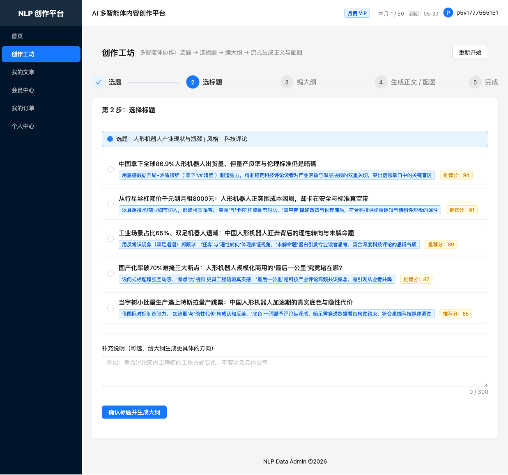
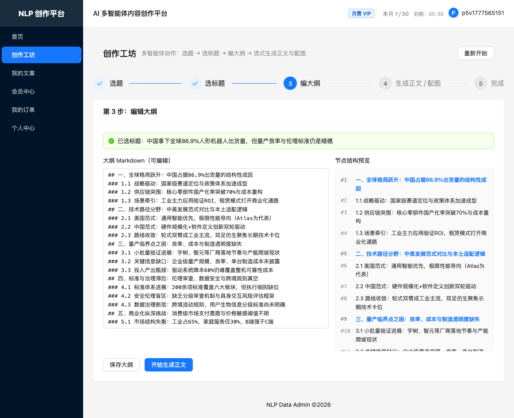
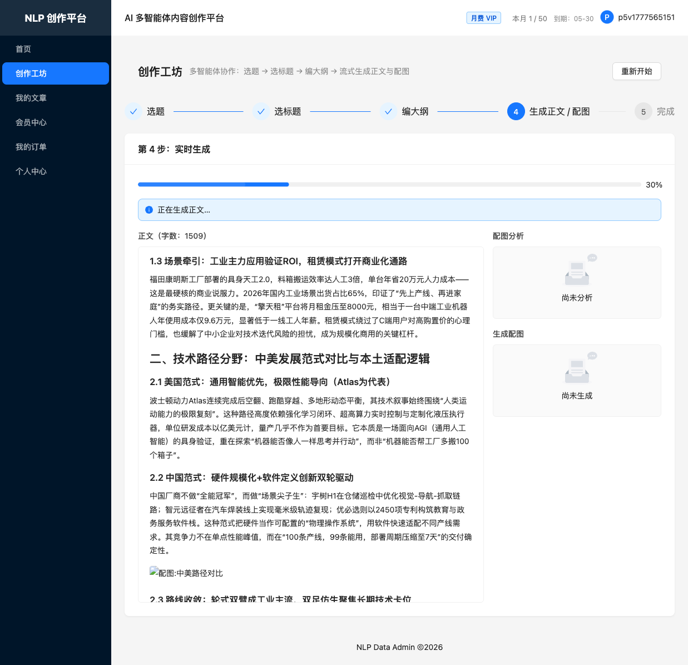
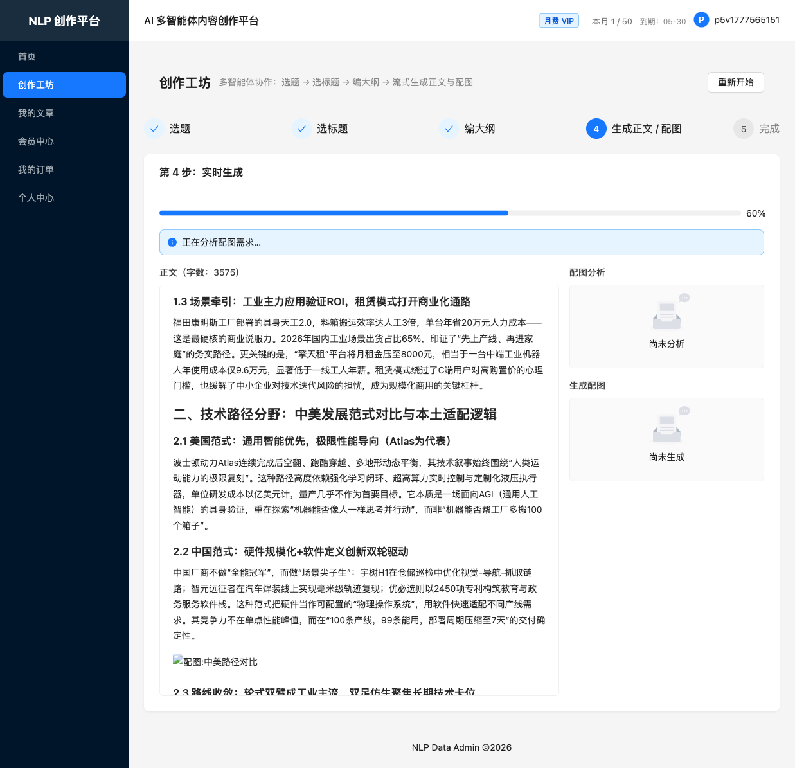
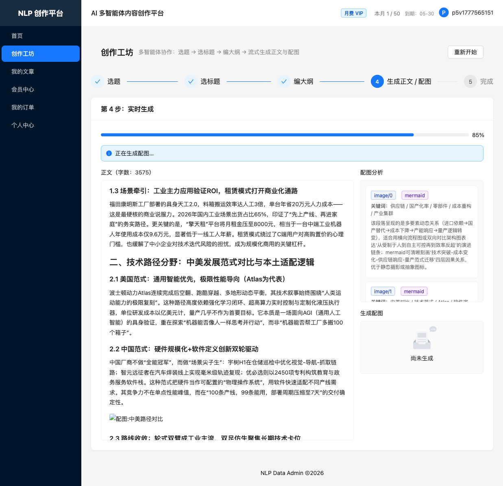

# NLP Data Admin

> AI 多智能体内容创作平台 — 让 5 个专业 Agent 为你协作，从选题到配图一站式完成高质量内容创作。

 

## ✨ 核心特性

- **🧠 多 Agent 编排**：TopicResearch · TitleGenerator · OutlineGenerator · ContentGenerator · ImageAnalyzer · ParallelImageGenerator 六环节流水线
- **🔎 选题背景研究**：Exa neural 搜索 + LLM 五段式事实清单（核心概念/关键事实/观点分歧/可引用数据/信息缺口），带缓存+单飞锁+令牌桶+用户配额四道防线，资料自动注入下游 4 Agent
- **✍️ Human-in-the-loop 创作工坊**：AI 生成标题你来选 → AI 生成大纲你可改 → AI 流式写正文可实时预览
- **🖼️ 6 种智能配图**：Pexels 真实图库 / Mermaid 流程图 / Iconify 图标 / Emoji / SVG 概念图 / AI 生图（Nano Banana）
- **⚡ 实时 SSE 流式**：边写边看的 Markdown，带 highlight.js 代码高亮，无刷新预览
- **👑 VIP 会员 + 配额**：免费 / 月费 / 年费三档，与 z-pay 聚合支付对接，微信/支付宝扫码
- **📊 可观测性 Dashboard**：ECharts 可视化 Agent 调用量、成功率、P95 耗时、日志流

## 🧱 技术栈

| 层       | 技术                                                                                                           |
| -------- | -------------------------------------------------------------------------------------------------------------- |
| 前端     | Vue 3 + TypeScript + Pinia + Vue Router 4 + Ant Design Vue 4 + Vite 8 + ECharts 5 + markdown-it + highlight.js |
| 后端     | Hyperf 3 + Swoole + PHP 8.2 + Eloquent ORM + JWT + PSR-7/15                                                    |
| 数据     | MySQL 8 + Redis 7                                                                                              |
| AI       | 阿里云 DashScope（qwen-plus / wanx2.1 万相文生图）                                                             |
| 配图     | Pexels API / Mermaid.ink / Iconify / Twemoji                                                                   |
| 托管     | 阿里云 OSS                                                                                                     |
| 支付     | z-pay（聚合微信 + 支付宝）                                                                                     |
| 基础设施 | Docker + Docker Compose + Nginx（SSE 反代）                                                                    |

## 🚀 快速开始

### 前置条件

- Docker 24+ 与 Docker Compose v2.20+

### 三步上线（生产模式）

```bash
# 1) 克隆
git clone <repo-url> nlp-data-admin && cd nlp-data-admin

# 2) 配置环境
cp backend/.env.example backend/.env
# 至少填写：JWT_SECRET / DASHSCOPE_API_KEY / DB_PASSWORD / REDIS_PASSWORD
# 推荐填写：PEXELS_API_KEY

# 3) 启动
cd docker/
docker compose -f docker-compose.yml -f docker-compose.prod.yml up -d --build
```

打开浏览器访问 `http://<服务器 IP>/`。完整部署说明见 [docs/deployment.md](./docs/deployment.md)。

### 🔑 默认管理员账号

迁移执行后会自动创建一个内置管理员（幂等操作，已存在则跳过）：

| 字段   | 值                                           |
| ------ | -------------------------------------------- |
| 邮箱   | `admin@nlp.local`                            |
| 用户名 | `admin`                                      |
| 密码   | `admin888`                                   |
| 角色   | `admin`                                      |
| VIP    | `yearly`（配额 999999，有效期至 2038-01-01） |

> ⚠️ 生产环境首次登录后请立即修改此密码，以免泄露风险。

### 本地开发模式

```bash
cd docker/
docker compose up -d
# 前端（Vite 热更新）:  http://localhost:5173
# 后端（挂载源码）:    http://localhost:9501
```

## 🎬 创作工坊体验

从选题到配图的 5 步完整流程（以「人形机器人产业现状与瓶颈」为例，研究资料已注入至候选标题/大纲/正文，含 `86.9% 出货量`、`70% 国产化率`、`宇树 H1`、`Atlas` 等精确行业数据与对标对象）：

| 步骤                       | 截图                                                        |
| -------------------------- | ----------------------------------------------------------- |
| ① 候选标题（研究注入生效） |        |
| ② AI 生成大纲              |    |
| ③ SSE 流式生成正文         |  |
| ④ 正文完成                 |  |
| ⑤ 配图完成（完整工作流）   |     |

## 🗂️ 项目结构

```
nlp-data-admin/
├── backend/                # Hyperf 后端
│   ├── app/
│   │   ├── Controller/     # HTTP 控制器（Auth/Workshop/Article/Vip/Pay/Observability...）
│   │   ├── Service/        # 业务服务 + 5 个 Agent 实现
│   │   ├── Model/          # Eloquent 模型
│   │   ├── Middleware/     # JWT / Admin / 配额中间件
│   │   └── ...
│   ├── config/             # Hyperf 配置
│   ├── migrations/         # 数据库迁移（6 张表 + VIP 套餐种子）
│   ├── Dockerfile          # 开发镜像（配合 volume 挂载）
│   └── Dockerfile.prod     # 生产镜像（多阶段构建）
├── frontend/               # Vue 3 前端
│   ├── src/
│   │   ├── pages/          # Home / Workshop / ArticleList / Dashboard / VipCenter / ...
│   │   ├── components/     # 创作工坊 / 看板 / Markdown 渲染组件
│   │   ├── stores/         # Pinia
│   │   └── api/            # axios + SSE 封装
│   └── vite.config.ts
├── docker/                 # 基础设施编排
│   ├── docker-compose.yml        # 开发 + 通用
│   ├── docker-compose.prod.yml   # 生产覆盖（Nginx 80/vendor/无端口暴露）
│   ├── backend/                  # 后端开发镜像 + entrypoint（wait-for/migrate/start）
│   ├── nginx/                    # Nginx（SSE 反代 + SPA + 多阶段前端构建）
│   ├── mysql/                    # MySQL 配置 + 初始化
│   └── redis/                    # Redis 配置
└── docs/                   # 项目文档
    ├── api.md              # API 接口文档
    └── deployment.md       # 部署指南
```

## 📚 文档

- [API 接口文档](./docs/api.md) — 完整端点定义、SSE 事件类型、状态枚举
- [部署指南](./docs/deployment.md) — 环境要求、一键部署、HTTPS、常见问题
- [环境变量模板](./backend/.env.example) — 所有配置项及其用途

## 🧪 常用命令

### 后端

```bash
# 进入容器
docker exec -it nlp-backend sh

# 手动迁移
docker exec -it nlp-backend php bin/hyperf.php migrate --force

# 查看路由列表
docker exec -it nlp-backend php bin/hyperf.php describe:routes

# 将某用户提升为 admin
docker exec nlp-mysql mysql -uroot -p$DB_PASSWORD nlp_content \
  -e "UPDATE users SET role='admin' WHERE email='x@y.com';"
```

### 前端

```bash
cd frontend/
npm run dev         # 本地 dev（不进 Docker）
npm run build       # 产线构建
npx vue-tsc -b      # 类型检查
```

## 🎯 路线图

- [x] Phase 1 基础设施契约修复
- [x] Phase 2 认证 + 模型 provider 抽象
- [x] Phase 3 多 Agent 编排（创作工坊）
- [x] Phase 4 多策略配图系统
- [x] Phase 5 VIP 会员 + z-pay 聚合支付
- [x] Phase 6 可观测性（AgentLog + AOP + Dashboard）
- [x] Phase 7 前端全流程联调（创作工坊 UI + Dashboard + 我的文章 + 个人中心）
- [x] Phase 8 部署与文档（Nginx SSE + 多阶段镜像 + 一键 `docker compose up`）
- [x] Topic Research Agent（Exa 搜索 + LLM 浓缩 + 四道防线 + 下游 4 Agent 注入 + 前端降级提示）

## 📄 License

本项目基于 [MIT License](./LICENSE) 开源，Copyright (c) 2026 [sword-demon](https://github.com/sword-demon)。
